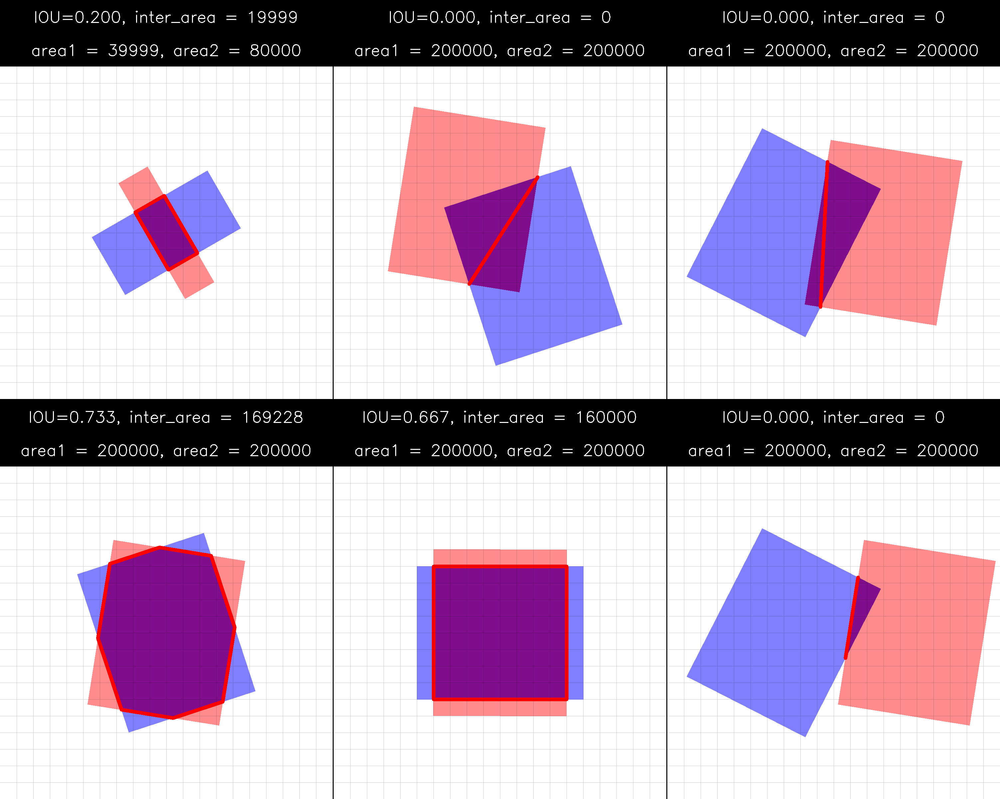

# Rotated polygons intersection and differenciable IoU in PyTorch

-----

This repository provides an implementation of polygons intersection and
evaluation of differenciable IoU in PyTorch. 
This functionality can be used to construct loss for rotated bounding boxes

The algorithm is based on lines intersections and assumes convex polygons which
is the case for rotated object detection (or polygons detection).

*Note*: polygons intersection is not yet heavily tested. There can be some bugs and edge cases. 
Please feel free to let me know about them

# Demonstration

-----

Below is the demo image which shows algorithm work for different cases. 
In addition, standard IoU for boxes which are parallel to coordinate axes is computed

# Other similar implementations

-----

Below is the list of other repositories which might be useful when dealing with rotated object detection loss: 
- [Rotated boxes intersection in YOLOv4][1]
- [Rotated IoU for 2d/3d][2]
- [Vectorized and differenciable GIoU for rotated bounding boxes][3]

[1]: https://github.com/maudzung/Complex-YOLOv4-Pytorch/blob/master/src/utils/cal_intersection_rotated_boxes.py
[2]: https://github.com/lilanxiao/Rotated_IoU/tree/debug
[3]: https://github.com/jw9730/ori-giou/blob/main/util/box_ops.py
